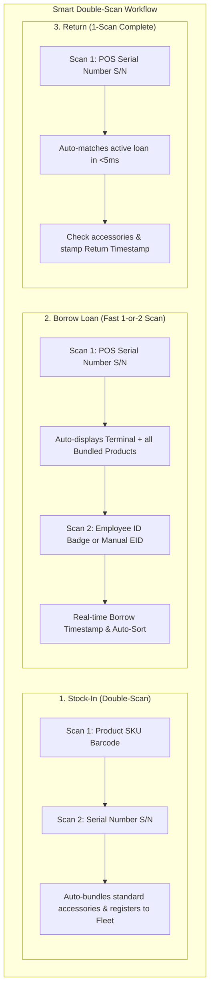
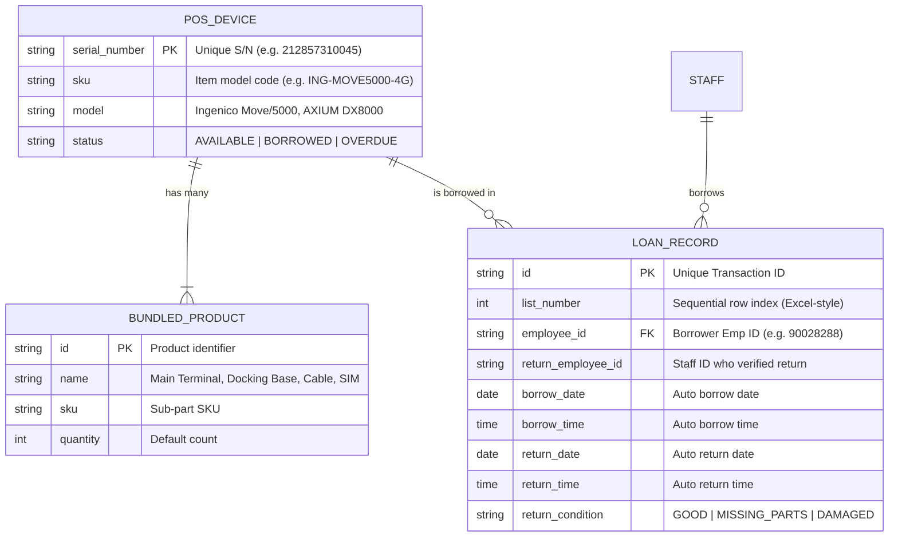

# POS Device Lending & Tracking System (TrackPOS)
## System Overview, Architecture & Workflow Specification

This system streamlines POS hardware dispatch and returns across branches and departments by replacing manual serial number entry with high-precision in-browser camera scanning on mobile devices and workstations.

---

## 1. High-Level Architecture & System Overview

```
+-------------------------------------------------------------------------------------------------------+
|                             Client Layer                                                              |
|                                                                                                       |
|   Admin Web Dashboard (Desktop/Tablet)                          Mobile Web Scanner                    |
|   - Analytics & Charts (Visual Graph view)                      - HTML5 Camera Feed (1080p, Macro)    |
|   - POS (One-to-Many: scan S/N & auto-sort bundled products)   - html5-qrcode / Native BarcodeDetector |
|   - Borrow / Return Logs (Excel-style editable sheet)           - Smart Double-Scan Engine            |
|   - Search & Manual Overrides (Date, EID, SKU, Product)        - Manual EID & Phone / Email Entry    |
+-----------------------------------+-------------------------------------------------------------------+
                                    | HTTPS / JSON (REST API)
                                    v
+-----------------------------------------------------------------------+
|                             Backend API                               |
|                                                                       |
|   - Auth & Middleware (Sanctum / JWT)                                 |
|   - Hardware Dispatch & Return Controller                             |
|   - Inventory & SKU/Serial Master Controller                          |
|   - Scheduled Cron Engine (Daily Summary Aggregator)                  |
+-------------------+-------------------------------+-------------------+
                    |                               |
                    v                               v
+-------------------------------+   +-----------------------------------+
|      Relational Database      |   |     External Services             |
|   - PostgreSQL / MySQL / SQLite|   |     - Telegram Bot API            |
|   - Device, Employee, Logs    |   |       (Automated daily PDF/CSV    |
|   - Indexing on SN & EID      |   |        reports via Telegram Chat) |
+-------------------------------+   +-----------------------------------+
```

---

## 2. Navigation Architecture

```
[ Nav: {Dashboard} | {POS (One-to-Many)} | {List of Borrow/Return} | {Search} | {Export Data & Telegram} ]
```

| Navigation Tab | Key Functionality & Workflow |
| :--- | :--- |
| **📊 Dashboard** | Visual analytics and graphs: Daily loan trends, active fleet statuses, branch distributions, and overdue monitors. |
| **📦 POS (One-to-Many)** | Dedicated inventory view. Scan a Serial Number to instantly view all related bundled products (terminal, cradle, charger, SIM, cable). Supports Smart Double-Scan for Stock-in. |
| **📋 List of Borrow/Return** | Excel-like master grid: `{List #}`, `{Borrower EID}`, `{Staff Name}`, `{SKU --- Related --- Product}`, `{Borrow Date & Time}`, `{Return EID}`, `{Return Date & Time}`, with inline `{Edit}` and `{Add New}`. |
| **🔍 Search** | Dedicated 4-facet filter: `{By Date Range}`, `{By Employee ID (EID)}`, `{By SKU}`, `{By Product Name}`. |
| **📤 Export & Telegram** | Instant CSV / Excel download + automated daily summary reports dispatched directly to your company's **Telegram Bot / Group Chat**. |

---

## 3. Scale Solution for 1,000+ Devices & "Double-Scan" Strategy

### The Problem
When tracking over 1,000 POS units across multiple branches:
- Serial numbers are long (e.g., 12-digit Ingenico `212857310045`).
- Different devices have the same model/SKU but distinct serial numbers.
- Each terminal is bundled with multiple items (Charging base, power adapter, spiral cable, 4G SIM card).

### The Solution: Smart Double-Scan & One-to-Many Indexing



---

## 4. One-to-Many Data Model



---

## 5. Automated Telegram Bot Reporting Engine

The system can automatically dispatch daily audit summaries at a designated time (e.g. 18:00) using the Telegram Bot API:

```
POST https://api.telegram.org/bot<BOT_TOKEN>/sendMessage
{
  "chat_id": "<CHAT_ID>",
  "parse_mode": "Markdown",
  "text": "📊 *TrackPOS Daily Fleet & Dispatch Audit Report*\n..."
}
```
Staff can also trigger an immediate dispatch at any time via the **"Send Report to Telegram Now"** button.
